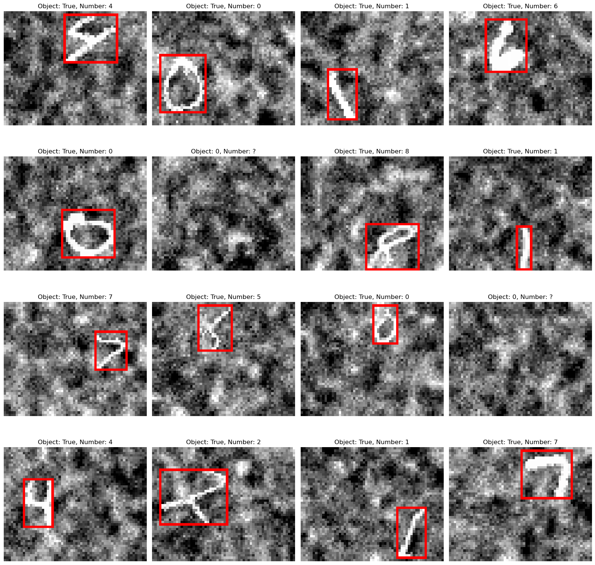
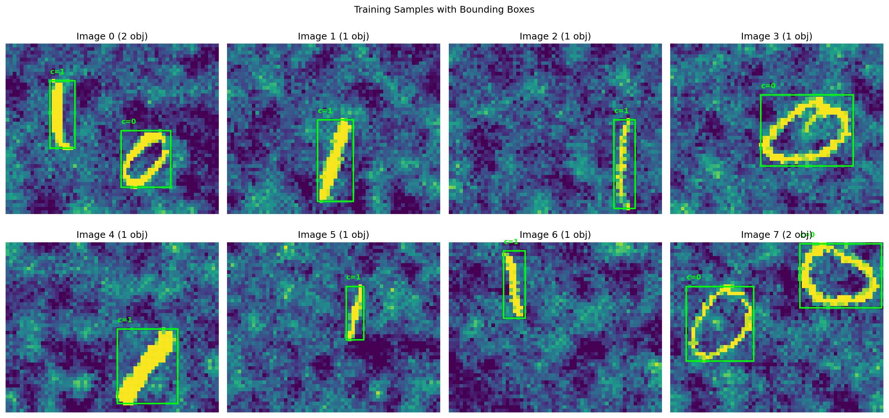
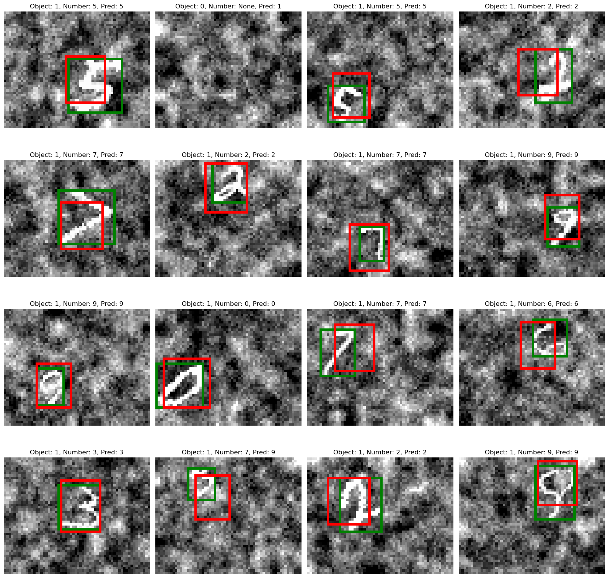

<h1 align="center">Report Object localization and Detection</h1> 
<h3 align="center">Project by Jakob Berg & Tobias Munch</h3> 


### Division of tasks:
We worked togheter on all of the tasks and never did one task alone. Below is a basic distrobution of the workflow on who tok the most charge on the different tasks. Toghether we discussed how we would go about traning the models and what approaches we would use throughout the project. Examples of this would be: Which hyperparameters to search and how thouroghly we would search them, what models to test and how we would build our methods and helpmethods.

Tobias:
* Object localization, model structures, hyperparametertuning, image-processing

Jakob:
* Object Detection, training loops, visualization

## Introduction

## Dataset overview and analysis

### Object Localization

The localization dataset consists of 48×60 grayscale images (pixel values normalized to [0, 1]), each containing either no object or a single handwritten digit with a bounding box annotation. The dataset is split as follows:

| Split | Size   |
|-------|--------|
| Train | 59,400 |
| Val   | 6,600  |
| Test  | 11,000 |

Approximately 9.1% of training images contain no digit (`pc = 0`), while the remaining 90.9% have exactly one object. Each label is a 6-element vector `[pc, cx, cy, w, h, label]`, where `pc` is the objectness flag, `(cx, cy)` is the normalized bounding box center, `(w, h)` is the normalized box size, and `label` is the digit class (0–9). For example, a sample label `[1.0, 0.60, 0.23, 0.37, 0.42, 4.0]` indicates a digit 4 centered at 60% from the left and 23% from the top, occupying roughly 37×42% of the image.

The digit class distribution among positive samples is approximately uniform, with digit 1 notably overrepresented at ~19% compared to ~9% for all other digits:

| Digit | Proportion |
|-------|-----------|
| 0     | 9.00%     |
| 1     | 19.32%    |
| 2     | 9.03%     |
| 3     | 9.30%     |
| 4     | 8.83%     |
| 5     | 8.23%     |
| 6     | 8.94%     |
| 7     | 9.50%     |
| 8     | 8.84%     |
| 9     | 9.02%     |

This imbalance means the classifier may slightly over-predict digit 1 if no corrective weighting is applied.



### Object Detection

The detection dataset consists of grayscale images containing one or more digits, each annotated with a bounding box and class label (0 or 1, representing two digit categories). The splits are:

| Split | Images | Min obj/img | Max obj/img | Mean obj/img |
|-------|--------|-------------|-------------|--------------|
| Train | 26,874 | 1 | 4 | 1.27 |
| Val   | 2,967  | 1 | 3 | 1.26 |
| Test  | 4,981  | 1 | 4 | 1.27 |

Each image contains at least one object, and most images contain a single object (mean ≈ 1.27). The dataset is nearly balanced between the two classes, with class 1 slightly overrepresented:

| Class | Train objects | Proportion |
|-------|---------------|------------|
| 0     | 16,035        | 46.8%      |
| 1     | 18,225        | 53.2%      |
| **Total** | **34,260** | — |

The mild class imbalance (≈7 percentage points) is unlikely to cause significant bias, but can be monitored via per-class precision and recall. The consistent mean objects-per-image across all three splits indicates the dataset was stratified well.



### Challenges
### Preprocessing and Sanity Checks

#### Object localization

Raw images are loaded as pre-stacked tensors from `.pt` files (train/val/test). Before training, pixel values are normalized using statistics computed exclusively from the training set:

```
mean = train_images.mean()   # scalar mean over all pixels and samples
std  = train_images.std()    # scalar std over all pixels and samples

x_norm = (x - mean) / std   # applied to train, val, and test
```

Global (scalar) normalization is used rather than per-channel or per-pixel normalization — since images are single-channel this is equivalent to standardizing the entire pixel distribution. Crucially, the val and test sets are normalized with the training mean and std to avoid data leakage. The original labels (bounding box coordinates and digit classes) are kept as-is and do not require normalization since they are already in a consistent [0, 1] normalized coordinate space.

#### Object detection

The detection pipeline adds a label conversion step on top of the same image normalization used for localization.

**Image normalization** is identical: scalar mean and std computed from training images only, applied to all splits.

**Label conversion — list to grid (`convert_to_grid`).** Raw annotations come as variable-length lists of objects per image (each object: `[pc, x, y, w, h, c]` in normalized image coordinates). These are converted to a fixed-size grid tensor of shape `(N, H_out, W_out, 6)` — here `H_out=2, W_out=3` — which divides the image into a 2×3 spatial grid of cells. For each object, the responsible cell is determined by the object's center:

```
col = int(x * W_out),  row = int(y * H_out)   # cell index (clamped to grid bounds)
```

The coordinates are then re-expressed relative to that cell:

```
x_local = x * W_out - col    # center x within cell [0, 1]
y_local = y * H_out - row    # center y within cell [0, 1]
w_local = w * W_out          # width  relative to cell size
h_local = h * H_out          # height relative to cell size
```

The cell's 6-vector is filled with `[pc, x_local, y_local, w_local, h_local, c]`. Cells with no assigned object remain all-zero (`pc=0`). This YOLO-style grid encoding allows the model to make spatially distributed predictions with a fixed-size output, while keeping box coordinates locally interpretable within each cell.


# Part 1: Object Localization

## Approach and Design Choices

The task is a multi-output localization problem: given a 48×60 grayscale image, the model must simultaneously (1) detect whether a digit is present, (2) predict its bounding box, and (3) classify which digit (0–9) it is. The output vector has six components: `[pc, cx, cy, w, h, label]`.

**Architecture.** A flexible convolutional neural network (`Net`) was implemented, supporting configurable numbers of convolutional layers, filter sizes, and fully connected layers. All models share the same backbone pattern: a stack of Conv2d → ReLU → MaxPool2d blocks, followed by fully connected layers with dropout, and a single output head of size `5 + num_classes` (one objectness logit + four box coordinates + 10 class logits).

**Loss function.** A composite localization loss was used with three terms:

- **Detection loss (Lₐ):** Binary cross-entropy with logits on the objectness score `pc`, computed over all samples.
- **Bounding box loss (L_b):** Mean squared error on the normalized `(cx, cy, w, h)` coordinates, computed only for positive samples (where an object is present).
- **Classification loss (L_c):** Cross-entropy on the 10-class digit logits, again only for positive samples.

The total loss is `Lₐ + L_b + L_c`.

**Normalization.** Input images were normalized using the training set mean and standard deviation (per-dataset, not per-channel), and the same statistics were applied to validation and test sets.

**Training.** All models were trained with SGD (lr=0.01, momentum=0.9), batch size 64, and early stopping with patience=5, restoring the best checkpoint by validation performance. The performance metric is defined as `0.5 × (accuracy + mean IoU)`, where accuracy counts a prediction as correct only if the object is detected *and* the digit class is correct.

**Dataset.** The training set contains 59,400 samples, validation 6,600, and test 11,000. Approximately 9.1% of samples have no object (`pc=0`); the remainder are roughly balanced across digits 0–9, with digit 1 slightly overrepresented (~19%).

---

## Models and Hyperparameters

Four architectures were compared:

| Model    | Conv layers (filters, kernel) | FC layers       | Dropout | 
|----------|-------------------------------|-----------------|---------|
| Light    | (4,3), (8,3)                  | [64]            | 0.0     |
| Standard | (6,5), (16,5)                 | [120, 84]       | 0.0     | 
| Deep     | (32,3), (64,3), (128,3)       | [512, 256]      | 0.5     |
| Wide     | (32,5), (64,5)                | [1024, 512, 256]| 0.3     | 

All models use MaxPool2d (2×2) after each conv block and output 15 values (1 + 4 + 10).

The flat feature sizes after the convolutional stack (computed automatically via a dummy forward pass) are:
- Light: 1,040
- Standard: 1,728
- Deep: 2,560
- Wide: 6,912

---

## Results

**Training curves:** Looking at the evolution of the traningloss in our models we can see some developments. The loss always decrease as the model gets trained to fit the data better. We can also se how the learning rate impacts how fast the model changes. When its too high, it causes the loss function to fluctuate, oscillate, or diverge, preventing the model from learning (This never happens to our models). A too low value leads to slow, stagnant learning, increasing training time and requiring more iterations. The models with dropout (deep and wide) should also train more slowly but generalize better. 


| Model    | Val Accuracy | Val IoU | Val Performance |
|----------|-------------|---------|-----------------|
| Light    | 0.7068      | 0.4193  | 0.5631          | 
| Deep     | 0.9280      | 0.4497  | 0.6838          | 
| Wide     | 0.8863      | 0.4843  | 0.6953          | 
| **Best** | 0.8863      | 0.4843  | 0.6953          | 


### About the best model
Our best model was a wide network with a learning rate of 0.01 and weight decay of 0. 


### Test results 

| Model    | Val Accuracy | Val IoU | Val Performance |
|----------|-------------|---------|-----------------|
| **Best** |  0.8878     | 0.4860  | 0.6869          | 




**Bounding box visualizations:** For qualitative assessment, `pred_vs_actual` overlays the ground-truth box (green) and predicted box (red) on the image. Visualizations from train, validation, and test sets illustrate how well the model localizes unseen digits.

---

## Discussion

**Multi-task learning tradeoffs.** The composite loss forces the network to simultaneously solve detection, localization, and classification. Because all three terms are equally weighted, the model has to balance improvements across tasks. In practice, the classification loss typically dominates early training since it has 10-way cross-entropy, while the MSE bounding box loss benefits from relatively clean targets.

**No-object handling.** Approximately 9% of training images contain no digit. The objectness branch is trained on all samples with BCE, while the box and class branches are only updated on positive examples. This avoids noisy gradients from regressing boxes on blank images. If the model over-predicts objectness, false positives on empty images degrade accuracy.

**Model capacity.** The Light model may underfit due to limited capacity, especially for simultaneously learning detection, localization, and classification. The Deep and Wide models have far more parameters but risk overfitting without sufficient regularization. Early stopping with patience=5 mitigates this; dropout in the Deep and Wide models provides further regularization.

**Class imbalance.** Digit 1 makes up ~19% of samples versus ~9% for most other digits. This could cause the classifier to slightly over-predict 1s. Adjusting class weights in the cross-entropy loss could address this if it proves problematic.

**IoU as a metric.** IoU is only meaningful for positive samples (where an object exists). A model that detects no objects would trivially score zero IoU but achieve high "accuracy" on the no-object class. The composite metric `0.5 × (accuracy + IoU)` balances both concerns, though it still conflates detection and classification into a single accuracy number. Separating precision/recall for detection from digit accuracy would provide a cleaner diagnostic.

**Normalization.** Global normalization (single mean/std over all pixels) was used rather than per-channel normalization. Since images are single-channel, this is equivalent, but using per-feature normalization or 2D spatial normalization could be explored for further improvement.


## Part 2: Object detection

### Approach and design choices

### Models and hyperparameters
* Accuracy, IoU, mean(Accuracy, IoU), mAP
* Training curves
* Bounding box visualizations (train & val & test)


### Discussion

## Conclusion

## Diclosure of AI

The service ChatGPT and Claude has been used for language editing and or improvements to the text in the report, and for resolving bugs in the training loop. Claude was also used to assist in giving templates for model structures in the Object Detection task. The final result was fact-checked and somewhat rewritten by its authors.