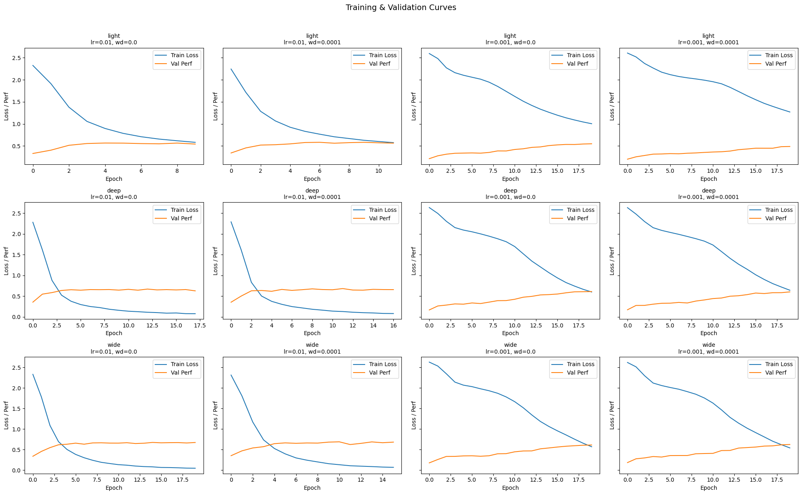
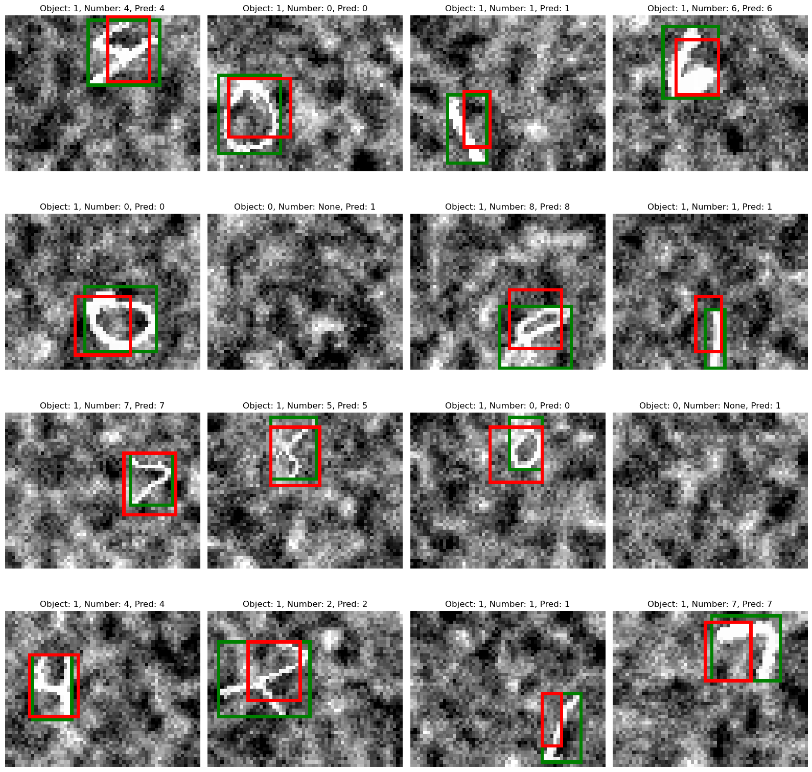
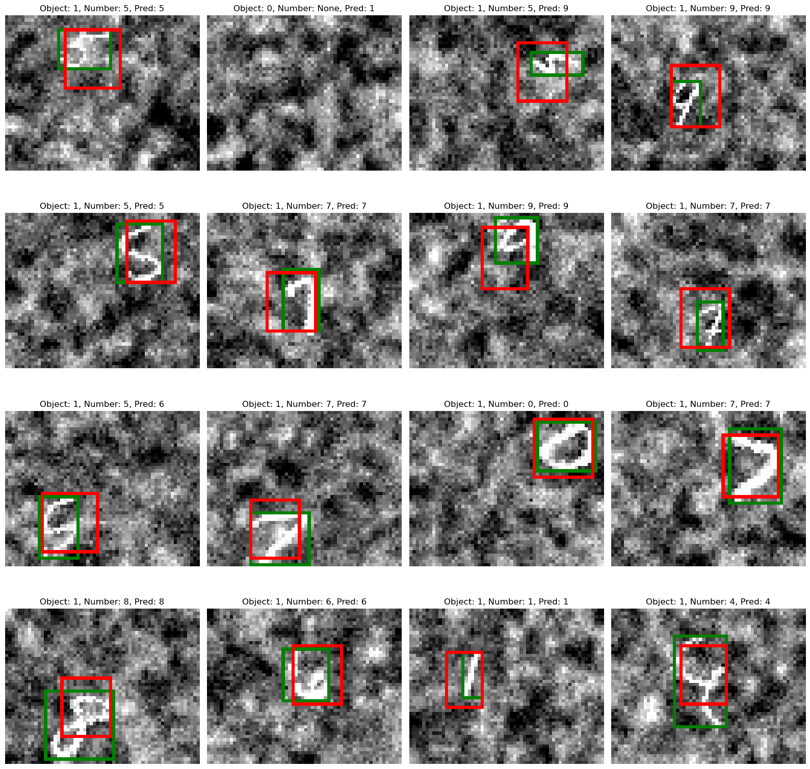
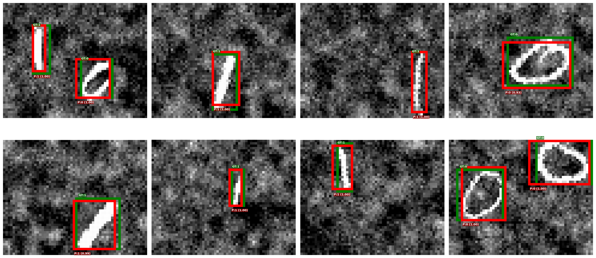

<h1 align="center">Report Object localization and Detection</h1> 
<h3 align="center">Project by Jakob Berg & Tobias Munch</h3> 


### Division of tasks:
We worked Together on all of the tasks and never did one task alone. Below is a basic distribution of the workflow on who tok the most charge on the different tasks. Together we discussed how we would go about training the models and what approaches we would use throughout the project. Examples of this would be: Which hyperparameters to search and how thouroghly we would search them, what models to test and how we would build our methods and helpmethods.

Tobias:
* Object localization, model structures, hyperparametertuning, image-processing

Jakob:
* Object Detection, training loops, visualization

## Disclosure of implementation: 

When working together on this project, we mostly worked alongside each other in pairs, with some work being done seperatly. The libraries we used were mainly pytorch, torchvision, matplotlib and numpy. We also used smaller libraries like math and copy. Matplotlib was used for visualizations, while the torchlibraries were used for the main machine learning tasks. Numpy was used for some matrix operations. 

## Introduction

In this project, we train convolutional neural networks (CNNs) to solve two related computer vision tasks: object localization and object detection, using an augmented version of the MNIST dataset. The images are 48×60 pixels and contain digits that are randomly positioned, slightly rotated, resized, and placed on a noisy background.
In the object localization task, we assume at most one digit per image. The goal is to both classify the digit and predict a bounding box around it. We extend a standard image classification network by adding outputs for the bounding box coordinates and an object presence score, and define a custom loss function combining detection, localization, and classification losses.
In the object detection task, we generalize this to images containing multiple digits. We divide each image into a grid of cells and treat each cell as an independent localization problem. This requires a fully convolutional architecture and additional data preprocessing to convert bounding box coordinates into cell-local coordinates.
For both tasks, we experiment with several model architectures and hyperparameter configurations, select the best-performing model based on a combination of accuracy and IoU, and evaluate it on the test set.

## Dataset overview and analysis

### Object Localization

The localization dataset consists of 48×60 grayscale images (pixel values normalized to [0, 1]), each containing either no object or a single handwritten digit with a bounding box annotation. The dataset is split as follows:

| Split | Size   |
|-------|--------|
| Train | 59,400 |
| Val   | 6,600  |
| Test  | 11,000 |

Approximately 9.1% of training images contain no digit (`pc = 0`), while the remaining 90.9% have exactly one object. Each label is a 6-element vector `[pc, cx, cy, w, h, label]`, where `pc` is the objectness flag, `(cx, cy)` is the normalized bounding box center, `(w, h)` is the normalized box size, and `label` is the digit class (0–9). For example, a sample label `[1.0, 0.60, 0.23, 0.37, 0.42, 4.0]` indicates a digit 4 centered at 60% from the left and 23% from the top, occupying roughly 37×42% of the image.

The digit class distribution among positive samples is approximately uniform, with digit 1 notably overrepresented at ~19% compared to ~9% for all other digits:

| Digit | Proportion |
|-------|-----------|
| 0     | 9.00%     |
| 1     | 19.32%    |
| 2     | 9.03%     |
| 3     | 9.30%     |
| 4     | 8.83%     |
| 5     | 8.23%     |
| 6     | 8.94%     |
| 7     | 9.50%     |
| 8     | 8.84%     |
| 9     | 9.02%     |

This imbalance means the classifier may slightly over-predict digit 1 if no corrective weighting is applied.


### Object Detection

The detection dataset consists of grayscale images containing one or more digits, each annotated with a bounding box and class label (0 or 1, representing two digit categories). The splits are:

| Split | Images | Min obj/img | Max obj/img | Mean obj/img |
|-------|--------|-------------|-------------|--------------|
| Train | 26,874 | 1 | 4 | 1.27 |
| Val   | 2,967  | 1 | 3 | 1.26 |
| Test  | 4,981  | 1 | 4 | 1.27 |

Each image contains at least one object, and most images contain a single object (mean ≈ 1.27). The dataset is nearly balanced between the two classes, with class 1 slightly overrepresented:

| Class | Train objects | Proportion |
|-------|---------------|------------|
| 0     | 16,035        | 46.8%      |
| 1     | 18,225        | 53.2%      |
| **Total** | **34,260** | — |

The mild class imbalance (≈7 percentage points) is unlikely to cause significant bias, but can be monitored via per-class precision and recall. The consistent mean objects-per-image across all three splits indicates the dataset was stratified well.


### Preprocessing and Sanity Checks

#### Object localization

Raw images are loaded as pre-stacked tensors from `.pt` files (train/val/test). Before training, pixel values are normalized using statistics computed exclusively from the training set:

```
mean = train_images.mean()   # scalar mean over all pixels and samples
std  = train_images.std()    # scalar std over all pixels and samples

x_norm = (x - mean) / std   # applied to train, val, and test
```

Global (scalar) normalization is used rather than per-channel or per-pixel normalization, since images are single-channel this is equivalent to standardizing the entire pixel distribution. Crucially, the val and test sets are normalized with the training mean and std to avoid data leakage. The original labels (bounding box coordinates and digit classes) are kept as-is and do not require normalization since they are already in a consistent [0, 1] normalized coordinate space.

#### Object detection

The detection pipeline adds a label conversion step on top of the same image normalization used for localization.

**Image normalization** is identical: scalar mean and std computed from training images only, applied to all splits.

**Label conversion — list to grid (`convert_to_grid`).** Raw annotations come as variable-length lists of objects per image (each object: `[pc, x, y, w, h, c]` in normalized image coordinates). These are converted to a fixed-size grid tensor of shape `(N, H_out, W_out, 6)`, here `H_out=2, W_out=3`, which divides the image into a 2×3 spatial grid of cells. For each object, the responsible cell is determined by the object's center:

```
col = int(x * W_out),  row = int(y * H_out)   # cell index (clamped to grid bounds)
```

The coordinates are then re-expressed relative to that cell:

```
x_local = x * W_out - col    # center x within cell [0, 1]
y_local = y * H_out - row    # center y within cell [0, 1]
w_local = w * W_out          # width  relative to cell size
h_local = h * H_out          # height relative to cell size
```

The cell's 6-vector is filled with `[pc, x_local, y_local, w_local, h_local, c]`. Cells with no assigned object remain all-zero (`pc=0`). This YOLO-style grid encoding allows the model to make spatially distributed predictions with a fixed-size output, while keeping box coordinates locally interpretable within each cell.


# Part 1: Object Localization

## Approach and Design Choices

The task is a multi-output localization problem: given a 48×60 grayscale image, the model must simultaneously (1) detect whether a digit is present, (2) predict its bounding box, and (3) classify which digit (0–9) it is. The output vector has six components: `[pc, cx, cy, w, h, label]`.

**Architecture.** A flexible convolutional neural network (`Net`) was implemented, supporting configurable numbers of convolutional layers, filter sizes, and fully connected layers. All models share the same backbone pattern: a stack of Conv2d → ReLU → MaxPool2d blocks, followed by fully connected layers with dropout, and a single output head of size `5 + num_classes` (one objectness logit + four box coordinates + 10 class logits).

**Loss function.** A composite localization loss was used with three terms:

- **Detection loss (L_a):** Binary cross-entropy with logits on the objectness score `pc`, computed over all samples.
- **Bounding box loss (L_b):** Mean squared error on the normalized `(cx, cy, w, h)` coordinates, computed only for positive samples (where an object is present).
- **Classification loss (L_c):** Cross-entropy on the 10-class digit logits, again only for positive samples.

The total loss is `L_a + L_b + L_c`.

**Normalization.** Input images were normalized using the training set mean and standard deviation (per-dataset, not per-channel), and the same statistics were applied to validation and test sets.

**Baseline:** The light model with the learning rate of 0.01 and no weight decay is our simplest model and wil act as our baseline

**Training.** All models were trained with SGD (momentum=0.9), batch size 64, and early stopping with patience=5, restoring the best checkpoint by validation performance. The performance metric is defined as `0.5 × (accuracy + mean IoU)`, where accuracy counts a prediction as correct only if the object is detected *and* the digit class is correct. We experimented with different values on: net depth, net width, learning rate, weight decay, and dropout rates.

**Dataset.** The training set contains 59,400 samples, validation 6,600, and test 11,000. Approximately 9.1% of samples have no object (`pc=0`); the remainder are roughly balanced across digits 0–9, with digit 1 slightly overrepresented (~19%).

---

## Models and Hyperparameters

Four architectures were compared:

| Model    | Conv layers (filters, kernel) | FC layers       | Dropout | 
|----------|-------------------------------|-----------------|---------|
| baseline | (4,3), (8,3)                  | [64]            | 0.0     |
| Light    | (4,3), (8,3)                  | [64]            | 0.0     |
| Deep     | (32,3), (64,3), (128,3)       | [512, 256]      | 0.5     |
| Wide     | (32,5), (64,5)                | [1024, 512, 256]| 0.3     | 

All models use MaxPool2d (2×2) after each conv block and output 15 values (1 + 4 + 10).

The flat feature sizes after the convolutional stack (computed automatically via a dummy forward pass) are:
- baseline: 1,040
- Light: 1,040
- Deep: 2,560
- Wide: 6,912

---

## Results



**Training curves:** Looking at the evolution of the traning loss in our models we can see some developments. The loss always decreases as the model gets trained to fit the data better. We can also se how the learning rate impacts how fast the model changes. When its too high, it causes the loss function to fluctuate, oscillate, or diverge, preventing the model from learning (This never happens to our models). A too low value leads to slow, stagnant learning, increasing training time and requiring more iterations. The models with dropout (deep and wide) should also train more slowly but generalize better. 


A table for the best versions of our Light, Deep and Wide nets 
| Model    | Val Accuracy | Val IoU | Val Performance |
|----------|-------------|---------|-----------------|
| Baseline | 0.6933      | 0.4368  | 0.5651          | 
| Light    | 0.7068      | 0.4193  | 0.5631          | 
| Deep     | 0.9280      | 0.4497  | 0.6838          | 
| Wide     | 0.8863      | 0.4843  | 0.6953          | 
| **Best** | 0.8863      | 0.4843  | 0.6953          | 


### About the best model
Our best model was a wide network with a learning rate of 0.01, weight decay of 0, and a dropout rate of 0.3. The learning rate of 0.01 is a standard, moderate value that allows the training loss to decrease steadily without risking unstable or overshooting updates. Having more neurons means the network can represent more complex functions and capture richer feature interactions. Wider layers increase the hypothesis space, allowing the model to fit more varied patterns in the data. Since we used dropout for regularization, weight decay was set to 0 to avoid over-constraining the model. A dropout rate of 0.3 means that during each training step, 30% of neurons are randomly deactivated. This prevents neurons from becoming too co-dependent and encourages the network to learn more robust, distributed representations improving generalization.

## Predictions 

### Train Predictions 


### Validation Predictions 


### Test Predictions 


**Bounding box visualizations:** For qualitative assessment, `pred_vs_actual` overlays the ground-truth box (green) and predicted box (red) on the image. Visualizations from train, validation, and test sets illustrate how well the model localizes unseen digits.


### Test results 

| Model    | Test Accuracy | Test IoU | Test Performance |
|----------|---------------|----------|-----------------|
| **Best** |  0.8878       | 0.4860   | 0.6869          | 


---

## Discussion

**Multi-task learning tradeoffs.** The composite loss forces the network to simultaneously solve detection, localization, and classification. Because all three terms are equally weighted, the model has to balance improvements across tasks. In practice, the classification loss typically dominates early training since it has 10-way cross-entropy, while the MSE bounding box loss benefits from relatively clean targets.

**No-object handling.** Approximately 9% of training images contain no digit. The objectness branch is trained on all samples with BCE, while the box and class branches are only updated on positive examples. This avoids noisy gradients from regressing boxes on blank images. If the model over-predicts objectness, false positives on empty images degrade accuracy.

**Model capacity.** The Light model may underfit due to limited capacity, especially for simultaneously learning detection, localization, and classification. The Deep and Wide models have far more parameters but risk overfitting without sufficient regularization. Early stopping with patience=5 mitigates this; dropout in the Deep and Wide models provides further regularization.

**Class imbalance.** Digit 1 makes up ~19% of samples versus ~9% for most other digits. This could cause the classifier to slightly over-predict 1s. Adjusting class weights in the cross-entropy loss could address this if it proves problematic.

**IoU as a metric.** IoU is only meaningful for positive samples (where an object exists). A model that detects no objects would trivially score zero IoU but achieve high "accuracy" on the no-object class. The composite metric `0.5 × (accuracy + IoU)` balances both concerns, though it still conflates detection and classification into a single accuracy number. Separating precision/recall for detection from digit accuracy would provide a cleaner diagnostic.

**Normalization.** Global normalization (single mean/std over all pixels) was used rather than per-channel normalization. Since images are single-channel, this is equivalent, but using per-feature normalization or 2D spatial normalization could be explored for further improvement.

**Failed approach.** We also tried a model with intermediate complexity between the Light and Deep/Wide architectures, but it performed significantly worse than all three other models. We suspect it fell in an awkward middle ground, too few parameters to learn the multi-task problem well, but enough to overfit without the regularization (dropout) used in the larger models. It was discarded early to save processing time.

**Are the results satisfying?** A random baseline would score roughly 10% accuracy (1 in 10 digit classes) and near-zero IoU, giving a combined performance close to 0.05. Our best model achieves 0.69, which is a large improvement over random chance. The accuracy of 0.89 shows the model classifies digits well, while the IoU of 0.49 indicates there is room for improvement in bounding box precision. Overall, the results are reasonable for relatively simple architectures trained without data augmentation.

**Given more time.** We would explore a broader hyperparameter search, particularly trying more learning rates and adding data augmentation (random shifts, rotations, and noise) to improve generalization. We would also experiment with weighting the three loss terms differently, as the current equal weighting may not be optimal. Finally, adding batch normalization to the convolutional layers could help stabilize training and potentially improve IoU.

## Conclusion
Our final model got a test performance of 0.6869. This is quite good in referance to how our model did on the validation data. We did expect a larger decrease from the validation data to the test data. This small decrease in performance to a new dataset is a sign that our model generalizes well to new data. We might have been able to get even better values if we experimentet with even more hyperparameter values. This was limited by our time and available resources. 


# Part 2: Object Detection

## Approach and Design Choices

**Grid encoding.** Each 48×60 grayscale image is divided into a **2×3 grid** of cells. Every cell predicts a 7-dimensional vector `[pc, x_local, y_local, w_local, h_local, logit_c0, logit_c1]`, where `pc` is an objectness score, `(x, y)` are the box centre coordinates relative to the cell, `(w, h)` are box dimensions relative to the cell size, and the last two entries are class logits. An object is assigned to the cell that contains its centre. This formulation follows the YOLO paradigm and allows the network to predict multiple objects in one forward pass.

**Coordinate conventions.** During decoding, sigmoid is applied to `(x, y)` to keep the centre within the cell, and `exp` is applied to `(w, h)` so dimensions are always positive. For evaluation, local cell coordinates are converted to global pixel coordinates via `local_to_global`, and then to corner format `(x1, y1, x2, y2)` via `xywh_to_xyxy`.

**Loss function.** The detection loss sums a per-cell localisation loss over all grid cells:

$$L_{\text{detection}} = \sum_{h=0}^{H_{\text{out}}-1} \sum_{w=0}^{W_{\text{out}}-1} L_{\text{localization}}[h, w]$$

where each cell's contribution is the unweighted sum of three terms:

$$L_{\text{localization}} = L_A + L_B + L_C$$

| Term | Description | Method |
|------|-------------|--------|
| $L_A$ | Objectness loss — all cells | BCE on predicted vs. true `pc` |
| $L_B$ | Box coordinate loss — object cells only | MSE on decoded `(x, y, w, h)` (sigmoid on x/y, exp on w/h) |
| $L_C$ | Classification loss — object cells only | Cross-entropy on class logits |

**Normalisation.** Pixel values are normalised using per-channel mean and standard deviation computed from the **training set only**, and the same statistics are applied to validation and test sets to avoid data leakage.

---

## Models

Three convolutional architectures share the same head design: `AdaptiveAvgPool2d((2, 3))` followed by a `1×1` convolution that produces 7 output channels (one per prediction per grid cell). The final output is reshaped from `(B, 7, 2, 3)` to `(B, 2, 3, 7)` to align with the label tensor layout.

#### FullyConvDetector *(baseline)*
A straightforward four-stage convolutional backbone and the **baseline model** for this comparison. It uses only standard convolutions with no residual connections or parameter-reduction techniques, making it the reference point against which the other architectures are evaluated. Each stage doubles the channel count while halving the spatial resolution via stride-2 convolutions.

```
Input 1×48×60
→ Conv(1→32, 3×3, s=2) + BN + ReLU   →  32×24×30
→ Conv(32→64, 3×3, s=2) + BN + ReLU  →  64×12×15
→ Conv(64→128, 3×3, s=2) + BN + ReLU → 128×6×8
→ Conv(128→256, 3×3, s=1) + BN + ReLU → 256×6×8
→ AdaptiveAvgPool(2×3)                → 256×2×3
→ Conv(256→7, 1×1)                    →   7×2×3
```

#### ResNetDetector
The same three downsampling stages as above but with a **residual block** inserted after each stage to improve gradient flow in deeper architectures. The final feature dimension is 128 (smaller than FullyConv) which reduces parameter count while the skip connections maintain representational capacity.

```
Input 1×48×60
→ Conv(1→32, s=2) + BN + ReLU + ResBlock(32)   → 32×24×30
→ Conv(32→64, s=2) + BN + ReLU + ResBlock(64)  → 64×12×15
→ Conv(64→128, s=2) + BN + ReLU + ResBlock(128)→ 128×6×8
→ AdaptiveAvgPool(2×3)                          → 128×2×3
→ Conv(128→7, 1×1)                              →   7×2×3
```

Each residual block: `Conv → BN → ReLU → Conv → BN` with an identity skip, followed by ReLU.

#### LightweightDetector
Uses **depthwise separable convolutions** (MobileNet-style) to reduce the parameter count substantially. A depthwise separable block first applies one filter per input channel (depthwise), then mixes channels with a `1×1` pointwise convolution, achieving similar receptive fields at a fraction of the FLOPs.

```
Input 1×48×60
→ Conv(1→16, 3×3, s=2) + BN + ReLU         → 16×24×30
→ DWSConv(16→32, s=2)                       → 32×12×15
→ DWSConv(32→64, s=2)                       → 64×6×8
→ DWSConv(64→128, s=1)                      → 128×6×8
→ AdaptiveAvgPool(2×3)                      → 128×2×3
→ Conv(128→7, 1×1)                          →   7×2×3
```

---

### Hyperparameter Search

All three models are trained under the same four hyperparameter configurations (12 runs total). Adam with `ReduceLROnPlateau` (patience=3, factor=0.5) is used in all runs. The best checkpoint (lowest validation loss) is saved and restored before evaluation.

| Config | Learning rate | Epochs | Batch size | Weight decay |
|--------|-------------|--------|------------|--------------|
| Baseline | 1e-3 | 20 | 64 | 0 |
| +WeightDecay | 1e-3 | 20 | 64 | 1e-4 |
| LowerLR | 5e-4 | 30 | 64 | 1e-4 |
| SmallBatch | 1e-4 | 20 | 32 | 1e-4 |

---

## Results

#### mAP Summary (Validation Set)

| Run | mAP | mAP@50 | mAP@75 |
|-----|-----|--------|--------|
| FullyConv — Baseline | 0.3468 | 0.7671 | 0.2647 |
| FullyConv — +WeightDecay | 0.3696 | 0.8046 | 0.2740 |
| FullyConv — LowerLR | 0.3183 | 0.7553 | 0.1975 |
| FullyConv — SmallBatch | 0.3287 | 0.7501 | 0.2326 |
| **ResNet — Baseline** | **0.5122** | **0.9423** | **0.5257** |
| ResNet — +WeightDecay | 0.4686 | 0.9253 | 0.4188 |
| ResNet — LowerLR | 0.4962 | 0.9283 | 0.4926 |
| ResNet — SmallBatch | 0.4320 | 0.8879 | 0.3660 |
| Lightweight — Baseline | 0.3228 | 0.7463 | 0.2114 |
| Lightweight — +WeightDecay | 0.3295 | 0.7509 | 0.2215 |
| Lightweight — LowerLR | 0.3148 | 0.7277 | 0.2229 |
| Lightweight — SmallBatch | 0.2528 | 0.6595 | 0.1218 |
| **Best model — ResNet Baseline (test set)** | **0.5123** | **0.9394** | **0.5145** |

The **best model** is **ResNetDetector with the Baseline hyperparameters** (lr=1e-3, no weight decay, batch size 64, 20 epochs), which achieves the highest validation mAP of 0.5122 across all 12 runs. This model is then re-evaluated on the held-out test set, yielding mAP 0.5123, confirming that the validation score was not inflated by hyperparameter overfitting.

**Why mAP over accuracy/IoU?** One could evaluate object detection by applying the localization metrics (accuracy and IoU) to each grid cell independently. However, this makes the performance measure grid-dependent and therefore model-dependent, which prevents fair comparison across architectures with different grid resolutions. Mean average precision (mAP) avoids this pitfall: predictions are first converted from local cell coordinates back to global image coordinates, and then evaluated against ground-truth boxes regardless of how the grid was defined. This makes mAP a grid-independent, model-independent metric suitable for comparing different detectors.

**Additional metrics (test set).** For completeness, the best model also achieves a per-cell accuracy of 0.9653, IoU of 0.7715, and mean accuracy-IoU of 0.8684 on the test set. These numbers are high because per-cell accuracy is dominated by the many empty cells that are trivially classified as background. While informative as a sanity check, these grid-dependent metrics are not used for model selection.

#### Training Curves


#### Bounding Box Visualisations

Detections are visualised with **green** boxes for ground truth and **red** boxes for predictions. Labels show class id and, for predictions, the detection confidence score (objectness × class probability).


**Sanity Check: Training samples (best model):**



**Validation samples (best model):**


**Test samples (best model):**


---

### Discussion

**Architecture comparison.** FullyConvDetector serves as the baseline, providing a simple reference without residual connections or depthwise separable convolutions. ResNet clearly outperforms both the baseline and Lightweight across every configuration. The best ResNet run (mAP 0.51) is about 0.14 mAP higher than the best FullyConv baseline run (mAP 0.37). The residual skip connections help gradients flow more easily during training, which lets the model learn better features with only 128 final channels compared to FullyConv's 256. Lightweight consistently ranks last. Even though depthwise separable convolutions use fewer parameters, the reduced capacity appears to be a real bottleneck when detecting small objects in noisy images. The parameter savings do not result in a useful speed vs. accuracy trade-off here.

**Effect of weight decay and learning rate.** The best ResNet configuration (lr=0.001, no weight decay) achieves mAP 0.51, while adding weight decay (1e-4) drops it to 0.47. This suggests the model is not overfitting significantly with these dataset sizes, and the regularisation may be slightly too aggressive. For FullyConv and Lightweight, weight decay gives a small improvement, indicating these simpler architectures benefit more from regularisation. Among learning rates, 0.001 works best for ResNet. Reducing to 0.0005 with longer training (30 epochs) gives a competitive mAP of 0.50, while 0.0001 with a smaller batch drops to 0.43. The low learning rate likely does not converge fully in 20 epochs, and extending to 30 epochs does not close the gap.

**mAP@50 vs. mAP@75.** All models score much higher on mAP@50 than mAP@75 (for example, 0.94 vs. 0.53 for the best run). This means the models reliably find objects and predict the correct class, but their bounding boxes are not very precise. This is expected because the 2x3 output grid is quite coarse: each cell covers roughly 30x24 pixels of the 60x48 image, so fine-grained box regression within a cell is difficult. Improving localisation precision would likely require a finer grid or anchor-based predictions.

**Training dynamics.** Models with lr=0.001 show the steepest loss reduction in the first 3–5 epochs, but training loss continues to decrease gradually afterward,  particularly for ResNet, where the gap between training and validation loss widens through epoch 20. The lower learning rate configurations converge more slowly: the SmallBatch runs (lr=0.0001) are still visibly declining past epoch 15. Validation loss generally stabilises earlier than training loss, and the two track each other reasonably well, with no severe overfitting. The learning rate scheduler reduces the rate in later epochs, visible as small drops in the loss curves. For ResNet, running 30 epochs at lr=0.0005 instead of 20 at lr=0.001 did not improve mAP meaningfully, so the longer runs appear unnecessary.

**Qualitative observations.** Looking at the bounding box visualisations, the model gets the class right most of the time with high confidence (usually 0.97 or above). Predicted boxes are close to the ground truth in most cases. The most common error is a slight mismatch in box size or position, especially for narrow diagonal objects where the aspect ratio is harder to predict. Images with two objects are generally handled well, with each object detected independently in its grid cell. Errors tend to happen when an object is near a cell boundary, where the cell assignment is less clear.

**Grid resolution limitation.** The 2x3 grid can predict at most one object per cell and six objects per image. For this dataset (average 1.27 objects per image, maximum 4), this is not a problem in practice. However, if two objects fall in the same cell, the second one is silently dropped during label encoding. A finer grid or multi-anchor approach would be needed for denser scenes.

**Are the results satisfying?** A random detector would produce boxes and class predictions with no correlation to the actual objects, yielding an mAP near zero. Our best model achieves mAP 0.51 and mAP@50 0.94, meaning it detects and classifies nearly all objects correctly at a loose IoU threshold. This is a satisfying result given the simplicity of our grid-based approach. The main weakness is bounding box precision (mAP@75 of 0.51), which is expected given the coarse 2x3 grid.

**Given more time.** We would try a finer output grid (e.g. 4×5) to improve bounding box precision, which is the main weakness shown by the gap between mAP@50 and mAP@75. We would also experiment with anchor boxes to handle objects of varying aspect ratios better, and run a more exhaustive hyperparameter search with more learning rate and weight decay combinations. Adding data augmentation could also help the model generalize to more varied object positions and scales.

## Conclusion

The best configuration, ResNetDetector with lr=0.001, no weight decay, batch size 64, and 20 epochs, achieves mAP 0.51, mAP@50 0.94, and mAP@75 0.51 on the held-out test set. This is very close to the validation performance (mAP 0.51), showing the model generalises well. The main findings are: residual connections give the largest improvement in architecture choice; a learning rate of 0.001 is the most important hyperparameter for strong performance; and the high mAP@50 shows the model detects and classifies reliably, while the lower mAP@75 shows that tighter bounding box precision is the main remaining weakness, limited by the coarse 2x3 output grid.

## Disclosure of AI

The service ChatGPT and Claude has been used for language editing and or improvements to the text in the report, and for resolving bugs especially in the training loop but also elsewhere. Claude was also used to assist in giving templates for model structures in the Object Detection task. The final result was fact-checked and somewhat rewritten by its authors.