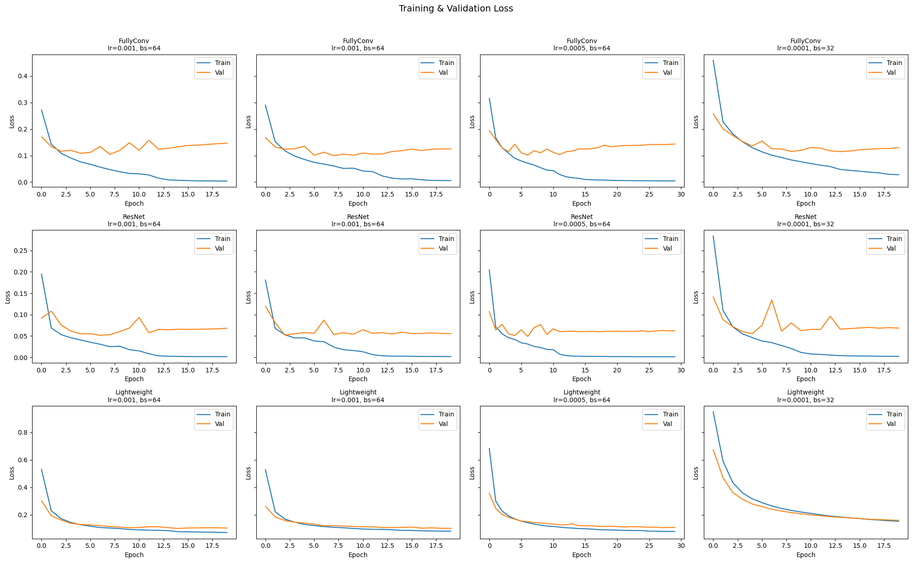
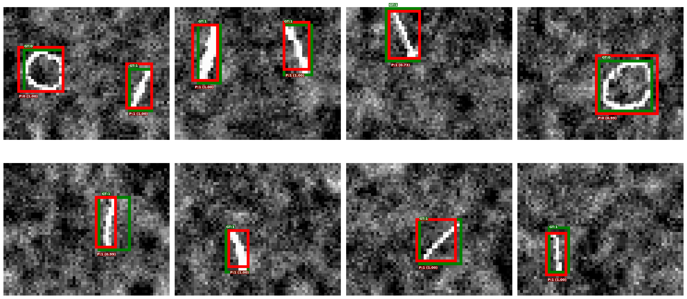
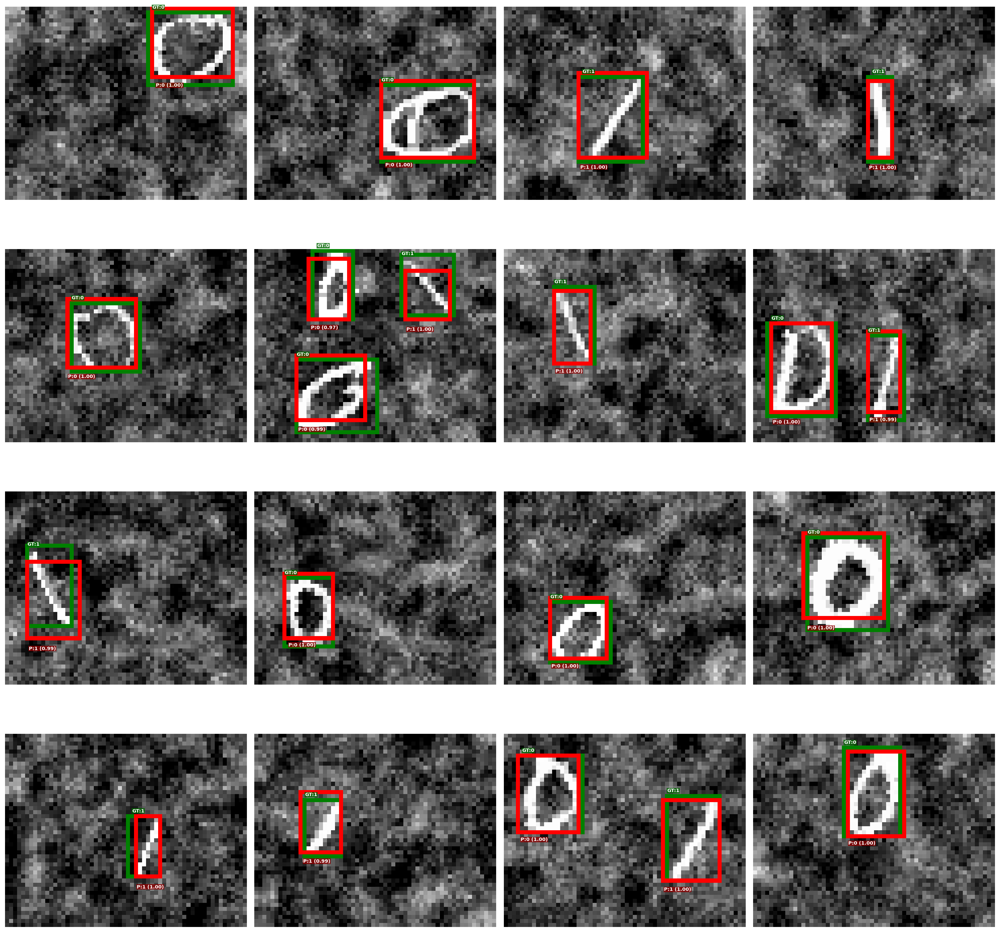

## Part 2: Object Detection

### Approach and Design Choices

**Grid encoding.** Each 48×60 grayscale image is divided into a **2×3 grid** of cells. Every cell predicts a 7-dimensional vector `[pc, x_local, y_local, w_local, h_local, logit_c0, logit_c1]`, where `pc` is an objectness score, `(x, y)` are the box centre coordinates relative to the cell, `(w, h)` are box dimensions relative to the cell size, and the last two entries are class logits. An object is assigned to the cell that contains its centre. This formulation follows the YOLO paradigm and allows the network to predict multiple objects in one forward pass.

**Coordinate conventions.** During decoding, sigmoid is applied to `(x, y)` to keep the centre within the cell, and `exp` is applied to `(w, h)` so dimensions are always positive. For evaluation, local cell coordinates are converted to global pixel coordinates via `local_to_global`, and then to corner format `(x1, y1, x2, y2)` via `xywh_to_xyxy`.

**Loss function.** The detection loss sums a per-cell localisation loss over all grid cells:

$$L_{\text{detection}} = \sum_{h=0}^{H_{\text{out}}-1} \sum_{w=0}^{W_{\text{out}}-1} L_{\text{localization}}[h, w]$$

where each cell's contribution is the unweighted sum of three terms:

$$L_{\text{localization}} = L_A + L_B + L_C$$

| Term | Description | Method |
|------|-------------|--------|
| $L_A$ | Objectness loss — all cells | BCE on predicted vs. true `pc` |
| $L_B$ | Box coordinate loss — object cells only | MSE on decoded `(x, y, w, h)` (sigmoid on x/y, exp on w/h) |
| $L_C$ | Classification loss — object cells only | Cross-entropy on class logits |

**Normalisation.** Pixel values are normalised using per-channel mean and standard deviation computed from the **training set only**, and the same statistics are applied to validation and test sets to avoid data leakage.

---

### Models

Three convolutional architectures share the same head design: `AdaptiveAvgPool2d((2, 3))` followed by a `1×1` convolution that produces 7 output channels (one per prediction per grid cell). The final output is reshaped from `(B, 7, 2, 3)` to `(B, 2, 3, 7)` to align with the label tensor layout.

#### FullyConvDetector
A straightforward four-stage convolutional backbone. Each stage doubles the channel count while halving the spatial resolution via stride-2 convolutions.

```
Input 1×48×60
→ Conv(1→32, 3×3, s=2) + BN + ReLU   →  32×24×30
→ Conv(32→64, 3×3, s=2) + BN + ReLU  →  64×12×15
→ Conv(64→128, 3×3, s=2) + BN + ReLU → 128×6×8
→ Conv(128→256, 3×3, s=1) + BN + ReLU → 256×6×8
→ AdaptiveAvgPool(2×3)                → 256×2×3
→ Conv(256→7, 1×1)                    →   7×2×3
```

#### ResNetDetector
The same three downsampling stages as above but with a **residual block** inserted after each stage to improve gradient flow in deeper architectures. The final feature dimension is 128 (smaller than FullyConv) which reduces parameter count while the skip connections maintain representational capacity.

```
Input 1×48×60
→ Conv(1→32, s=2) + BN + ReLU + ResBlock(32)   → 32×24×30
→ Conv(32→64, s=2) + BN + ReLU + ResBlock(64)  → 64×12×15
→ Conv(64→128, s=2) + BN + ReLU + ResBlock(128)→ 128×6×8
→ AdaptiveAvgPool(2×3)                          → 128×2×3
→ Conv(128→7, 1×1)                              →   7×2×3
```

Each residual block: `Conv → BN → ReLU → Conv → BN` with an identity skip, followed by ReLU.

#### LightweightDetector
Uses **depthwise separable convolutions** (MobileNet-style) to reduce the parameter count substantially. A depthwise separable block first applies one filter per input channel (depthwise), then mixes channels with a `1×1` pointwise convolution — achieving similar receptive fields at a fraction of the FLOPs.

```
Input 1×48×60
→ Conv(1→16, 3×3, s=2) + BN + ReLU         → 16×24×30
→ DWSConv(16→32, s=2)                       → 32×12×15
→ DWSConv(32→64, s=2)                       → 64×6×8
→ DWSConv(64→128, s=1)                      → 128×6×8
→ AdaptiveAvgPool(2×3)                      → 128×2×3
→ Conv(128→7, 1×1)                          →   7×2×3
```

---

### Hyperparameter Search

All three models are trained under the same four hyperparameter configurations (12 runs total). Adam with `ReduceLROnPlateau` (patience=3, factor=0.5) is used in all runs. The best checkpoint (lowest validation loss) is saved and restored before evaluation.

| Config | Learning rate | Epochs | Batch size | Weight decay |
|--------|-------------|--------|------------|--------------|
| Baseline | 1e-3 | 20 | 64 | 0 |
| +WeightDecay | 1e-3 | 20 | 64 | 1e-4 |
| LowerLR | 5e-4 | 30 | 64 | 1e-4 |
| SmallBatch | 1e-4 | 20 | 32 | 1e-4 |

---

### Results

#### mAP Summary (Validation Set)

| Run | mAP | mAP@50 | mAP@75 |
|-----|-----|--------|--------|
| FullyConv — Baseline | 0.3017 | 0.7608 | 0.1516 |
| FullyConv — +WeightDecay | 0.3313 | 0.7697 | 0.2217 |
| FullyConv — LowerLR | 0.3014 | 0.7279 | 0.1906 |
| FullyConv — SmallBatch | 0.2901 | 0.7041 | 0.1670 |
| ResNet — Baseline | 0.3740 | 0.8344 | 0.2754 |
| ResNet — +WeightDecay | 0.4804 | 0.9275 | 0.4447 |
| ResNet — LowerLR | 0.4613 | 0.9094 | 0.4323 |
| ResNet — SmallBatch | 0.4007 | 0.8949 | 0.2782 |
| Lightweight — Baseline | 0.3022 | 0.7446 | 0.1606 |
| Lightweight — +WeightDecay | 0.2973 | 0.7237 | 0.1781 |
| Lightweight — LowerLR | 0.2782 | 0.7063 | 0.1532 |
| Lightweight — SmallBatch | 0.2317 | 0.6335 | 0.0921 |
| **Best model (test set)** | **0.4709** | **0.9165** | **0.4395** |

#### Training Curves

<!-- Insert: 3×4 grid of train/val loss plots (one subplot per model × hyperparameter config) -->
<!-- Figure title: "Training & Validation Loss per Model and Hyperparameter Configuration" -->



#### Bounding Box Visualisations

Detections are visualised with **green** boxes for ground truth and **red** boxes for predictions. Labels show class id and, for predictions, the detection confidence score (objectness × class probability).

**Validation samples (best model):**

<!-- Insert: show_detection_samples output — best model on val_norm, n=4 -->



**Test samples (best model):**

<!-- Insert: show_detection_samples output — best model on test_norm, n=16 -->



---

### Discussion

**Architecture comparison.** ResNet clearly outperforms both FullyConv and Lightweight across every configuration. The best ResNet run (mAP 0.48) is about 0.15 mAP higher than the best FullyConv run (mAP 0.33). The residual skip connections help gradients flow more easily during training, which lets the model learn better features with only 128 final channels compared to FullyConv's 256. Lightweight consistently ranks last. Even though depthwise separable convolutions use fewer parameters, the reduced capacity appears to be a real bottleneck when detecting small objects in noisy images. The parameter savings do not result in a useful speed vs. accuracy trade-off here.

**Effect of weight decay and learning rate.** Weight decay has the strongest effect on performance. Removing it from the best ResNet configuration (lr=0.001) drops mAP from 0.48 to 0.37. This drop is larger than any gain from changing the learning rate, which suggests the model overfits somewhat without regularisation. Among learning rates, 0.001 works best for ResNet. Reducing to 0.0005 costs about 0.02 mAP, and 0.0001 with a smaller batch costs about 0.08 mAP. The low learning rate likely does not converge fully in 20 epochs, and extending to 30 epochs does not close the gap.

**mAP@50 vs. mAP@75.** All models score much higher on mAP@50 than mAP@75 (for example, 0.93 vs. 0.44 for the best run). This means the models reliably find objects and predict the correct class, but their bounding boxes are not very precise. This is expected because the 2x3 output grid is quite coarse: each cell covers roughly 30x24 pixels of the 60x48 image, so fine-grained box regression within a cell is difficult. Improving localisation precision would likely require a finer grid or anchor-based predictions.

**Training dynamics.** All models converge quickly within the first 5 epochs. Training and validation loss track each other closely throughout, with no clear overfitting. The dataset of roughly 27K training images is large enough relative to model size. The learning rate scheduler reduces the rate in later epochs, which can be seen as small drops in the loss curves. For ResNet, running 30 epochs instead of 20 did not improve mAP meaningfully, so the longer runs appear unnecessary.

**Qualitative observations.** Looking at the bounding box visualisations, the model gets the class right most of the time with high confidence (usually 0.97 or above). Predicted boxes are close to the ground truth in most cases. The most common error is a slight mismatch in box size or position, especially for narrow diagonal objects where the aspect ratio is harder to predict. Images with two objects are generally handled well, with each object detected independently in its grid cell. Errors tend to happen when an object is near a cell boundary, where the cell assignment is less clear.

**Grid resolution limitation.** The 2x3 grid can predict at most one object per cell and six objects per image. For this dataset (average 1.27 objects per image, maximum 4), this is not a problem in practice. However, if two objects fall in the same cell, the second one is silently dropped during label encoding. A finer grid or multi-anchor approach would be needed for denser scenes.

---

## Conclusion

The best configuration, ResNetDetector with lr=0.001, weight decay 1e-4, batch size 64, and 20 epochs, achieves mAP 0.47, mAP@50 0.92, and mAP@75 0.44 on the held-out test set. This is very close to the validation performance (mAP 0.48), showing the model generalises well. The main findings are: residual connections give the largest improvement in architecture choice; weight decay is the most important regularisation setting; and the high mAP@50 shows the model detects and classifies reliably, while the lower mAP@75 shows that tighter bounding box precision is the main remaining weakness, limited by the coarse 2x3 output grid.
